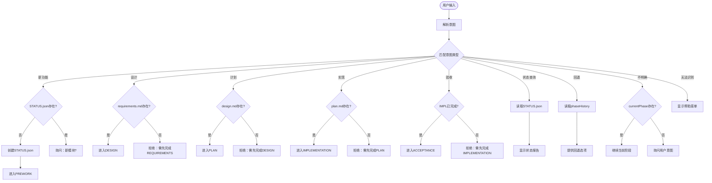

# 🧭 Phase Router - 意图检测与路由

> **用途**: 根据用户输入自动识别意图并路由到正确的阶段。

---

## 决策树（Decision Tree）

```
用户输入 → 意图分析 → 检查前置条件 → 路由到阶段 OR 拒绝
```

---

## 1. 意图识别规则

### 1.1 新功能请求

**触发词**（中文）：
- "我想要..."
- "需要一个功能"
- "添加..."
- "开发..."
- "能不能..."

**触发词**（英文）：
- "I want..."
- "add feature"
- "need to build"
- "can you create"

**识别逻辑**：
```
IF (用户提到新功能) AND (STATUS.json 不存在 OR 用户明确说"新模块"):
  → 动作：创建 STATUS.json → 进入 PREWORK 阶段
  → 输出：
     "✅ 开始新模块：[module-name]
      📝 已创建 STATUS.json
      🔄 当前阶段：PREWORK
      ➡️  下一步：收集项目上下文（识别框架、依赖、相似功能）"
```

---

### 1.2 设计请求

**触发词**（中文）：
- "设计"
- "怎么实现"
- "架构"
- "如何构建"
- "技术方案"

**触发词**（英文）：
- "design"
- "architecture"
- "how to implement"
- "technical approach"

**识别逻辑**：
```
IF 用户询问设计/架构:
  CHECK: requirements.md 是否存在？
    YES → 进入 DESIGN 阶段
          加载 .spec-rules/phases/DESIGN.md
          输出："✅ 进入 DESIGN 阶段。基于 requirements.md 开始架构设计。"
    NO  → 拒绝
          输出："❌ 缺少前置条件：requirements.md 不存在。
                 请先完成 REQUIREMENTS 阶段。
                 提示：说'开始需求分析'以进入 Phase 1。"
```

---

### 1.3 计划请求

**触发词**（中文）：
- "计划"
- "步骤"
- "怎么做"
- "执行方案"

**触发词**（英文）：
- "plan"
- "steps"
- "how to build"
- "implementation plan"

**识别逻辑**：
```
IF 用户询问计划/步骤:
  CHECK: design.md 是否存在？
    YES → 进入 PLAN 阶段
          加载 .spec-rules/phases/PLAN.md
          输出："✅ 进入 PLAN 阶段。基于 design.md 创建可执行步骤。"
    NO  → 拒绝
          输出："❌ 缺少前置条件：design.md 不存在。
                 请先完成 DESIGN 阶段。"
```

---

### 1.4 实现请求

**触发词**（中文）：
- "开始"
- "执行"
- "实现"
- "写代码"
- "构建"

**触发词**（英文）：
- "start"
- "implement"
- "build it"
- "let's code"
- "execute"

**识别逻辑**：
```
IF 用户要求开始实现:
  CHECK: plan.md 是否存在？
    YES → 进入 IMPLEMENTATION 阶段
          加载 .spec-rules/phases/IMPLEMENTATION.md
          读取 plan.md，识别下一个未完成步骤
          输出："✅ 进入 IMPLEMENTATION 阶段。
                 📋 计划已加载。
                 ➡️  当前步骤：[Step X.Y] - [步骤描述]
                 ⚠️  提醒：每步完成后必须运行验证命令。"
    NO  → 拒绝
          输出："❌ 缺少前置条件：plan.md 不存在。
                 请先完成 PLAN 阶段。"
```

---

### 1.5 验收请求

**触发词**（中文）：
- "验收"
- "测试"
- "完成了吗"
- "检查"
- "demo"

**触发词**（英文）：
- "acceptance"
- "review"
- "is it done"
- "demo"
- "validate"

**识别逻辑**：
```
IF 用户要求验收:
  CHECK: STATUS.json 中 IMPLEMENTATION 是否标记为 APPROVED？
    YES → 进入 ACCEPTANCE 阶段
          加载 requirements.md（获取验收标准）
          输出："✅ 进入 ACCEPTANCE 阶段。
                 📋 验收标准已加载。
                 ➡️  请逐项验证 Gherkin 场景。"
    NO  → 拒绝
          输出："❌ 前置条件未满足：IMPLEMENTATION 尚未完成。
                 当前状态：[currentPhase]
                 建议：完成实现阶段后再进行验收。"
```

---

### 1.6 状态查询

**触发词**（中文）：
- "状态"
- "进度"
- "到哪了"
- "现在在哪"

**触发词**（英文）：
- "status"
- "progress"
- "where are we"
- "current state"

**识别逻辑**：
```
IF 用户询问状态:
  读取 STATUS.json
  输出：
    "📊 项目状态报告
     
     📦 模块：[module]
     🔄 当前阶段：[currentPhase]
     ➡️  下一步：[nextAction]
     📅 最后更新：[lastUpdated]
     
     📜 阶段历史：
     [phaseHistory 的格式化输出]
     
     🚧 阻塞问题：
     [blockers 列表，如有]
     
     📝 变更请求：
     [changeRequests 列表，如有]"
```

---

### 1.7 回退/重做请求

**触发词**（中文）：
- "回退"
- "重做"
- "返回"
- "重新开始"

**触发词**（英文）：
- "backtrack"
- "go back"
- "redo"
- "reset"

**识别逻辑**：
```
IF 用户要求回退:
  读取 STATUS.json 的 phaseHistory
  找到最后一个 status = "APPROVED" 的阶段
  
  询问用户：
    "🔙 检测到回退请求。
     
     最后成功阶段：[last approved phase]
     
     选项：
     1. 回退到 [phase name]（最后成功阶段）
     2. 回退到特定阶段（请指定）
     3. 完全重置（删除所有进度）
     
     请选择：[1/2/3]"
  
  用户选择后：
    - 更新 currentPhase
    - 标记后续阶段为 INVALIDATED
    - 创建 Change Request 记录原因
```

---

## 2. 前置条件检查矩阵

| 目标阶段 | 必需文件 | 必需状态 | 检查命令 |
|---------|---------|---------|---------|
| PREWORK | 无 | 无 | 无 |
| REQUIREMENTS | prework.md | PREWORK = APPROVED | 检查文件存在 |
| DESIGN | requirements.md | REQUIREMENTS = APPROVED | 检查文件存在且包含 Gherkin 场景 |
| PLAN | design.md | DESIGN = APPROVED | 检查文件存在且包含架构图 |
| IMPLEMENTATION | plan.md | PLAN = APPROVED | 检查文件存在且包含验证命令 |
| ACCEPTANCE | 工作代码 | IMPLEMENTATION = APPROVED | 检查构建和测试通过 |

---

## 3. 模糊输入处理

### 3.1 不明确的请求

**示例**：用户说"继续"或"下一步"

**处理逻辑**：
```
读取 STATUS.json
IF currentPhase 存在:
  IF nextAction 存在:
    输出："✅ 继续 [currentPhase] 阶段。
           ➡️  下一步：[nextAction]"
    执行 nextAction
  ELSE:
    输出："📍 当前在 [currentPhase] 阶段。
           请告诉我你想做什么：
           - 完成当前阶段？
           - 进入下一阶段？
           - 查看状态？"
ELSE:
  输出："❓ 未找到活跃模块。请先开始新模块或指定模块名称。"
```

---

### 3.2 跨阶段请求

**示例**：用户在 DESIGN 阶段说"开始实现"

**处理逻辑**：
```
当前阶段：DESIGN
请求阶段：IMPLEMENTATION

检查：
  DESIGN 是否已 APPROVED？
    NO → 拒绝
         输出："❌ 不能跳过阶段。DESIGN 尚未完成和批准。
                当前任务：完成 design.md
                完成后运行 QA 检查，通过后才能进入 PLAN 阶段。"
    YES → 检查 PLAN 是否已 APPROVED？
          NO → 拒绝（同上，需要先完成 PLAN）
          YES → 允许进入 IMPLEMENTATION
```

---

### 3.3 无法识别的输入

**处理逻辑**：
```
IF 无法匹配任何意图:
  输出："🤔 抱歉，我不确定你的意图。
  
         你可以：
         - 📝 开始新功能：说'我想要 [功能描述]'
         - 🎨 查看设计：说'设计'或'架构'
         - 📋 制定计划：说'计划'或'步骤'
         - 🔨 开始实现：说'开始实现'或'执行'
         - ✅ 验收功能：说'验收'或'测试'
         - 📊 查看状态：说'状态'或'进度'
         
         或者直接描述你想做的事情。"
```

---

## 4. 多模块场景

当项目有多个模块时：

```
IF 用户提到具体模块名:
  → 使用该模块的 STATUS.json
  
IF 用户未指定模块 AND 存在多个 specs/ 子目录:
  → 列出所有模块，询问用户选择：
     "📦 检测到多个模块：
      1. user-auth (当前阶段：IMPLEMENTATION)
      2. payment-flow (当前阶段：DESIGN)
      3. dashboard (当前阶段：COMPLETE)
      
      请选择要继续的模块，或说'新模块'开始新功能。"
```

---

## 5. 紧急退出

**触发词**：
- "停"
- "取消"
- "暂停"
- "stop"
- "cancel"

**处理逻辑**：
```
IF 用户要求停止:
  1. 保存当前进度到 STATUS.json
     - 更新 lastUpdated
     - 记录 nextAction（恢复点）
  
  2. 输出：
     "⏸️  已暂停。进度已保存。
      
      📍 恢复点：
      - 模块：[module]
      - 阶段：[currentPhase]
      - 下一步：[nextAction]
      
      下次继续时，说'继续 [module]'即可恢复。"
```

---

## 6. 路由流程图



---

## 7. 使用示例

### 示例 1：新用户首次使用

```
用户："我想添加一个用户认证功能"
AI：
  1. 解析意图：新功能请求
  2. 检查：specs/user-auth/STATUS.json 不存在
  3. 执行：创建 STATUS.json，设置 currentPhase = "PREWORK"
  4. 输出：
     "✅ 开始新模块：user-auth
      📝 已创建 specs/user-auth/STATUS.json
      🔄 当前阶段：PREWORK（上下文收集）
      ➡️  下一步：收集项目上下文
      
      我将开始分析项目结构...
      [执行 ls, grep 等命令]"
```

### 示例 2：跨阶段跳跃被阻止

```
用户："直接帮我实现登录功能"
AI：
  1. 解析意图：实现请求
  2. 检查前置条件：
     - requirements.md 不存在 ❌
     - design.md 不存在 ❌
     - plan.md 不存在 ❌
  3. 输出：
     "❌ 无法直接进入实现阶段。缺少必需的前置阶段：
      
      必须完成的阶段：
      1. ⬜ REQUIREMENTS - 定义需求和验收标准
      2. ⬜ DESIGN - 架构设计和接口定义
      3. ⬜ PLAN - 可执行步骤计划
      
      建议：让我们从需求分析开始。
      说'开始需求分析'以进入 Phase 1。"
```

### 示例 3：恢复已有进度

```
用户："继续"
AI：
  1. 读取 STATUS.json
  2. 发现 currentPhase = "IMPLEMENTATION", nextAction = "执行步骤 2.3"
  3. 输出：
     "✅ 恢复进度
      📦 模块：user-auth
      🔄 当前阶段：IMPLEMENTATION
      ➡️  下一步：步骤 2.3 - 创建登录API端点
      
      开始执行步骤 2.3..."
```

---

## 8. 调试与日志

当路由出现问题时，AI 应该输出调试信息：

```
[DEBUG] 意图检测
- 用户输入："开始实现"
- 识别意图：IMPLEMENTATION
- 检查前置条件：
  ✅ STATUS.json 存在
  ✅ currentPhase = "PLAN"
  ✅ plan.md 存在
  ✅ PLAN 状态 = "APPROVED"
- 决策：允许进入 IMPLEMENTATION
- 加载规则：.spec-rules/phases/IMPLEMENTATION.md
```

这些调试信息应该在开发/测试时输出，生产使用时可省略。

