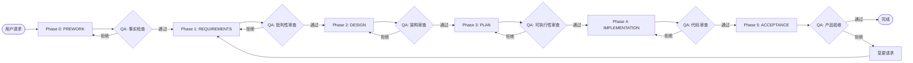

# 🎯 SDD 核心协议

> **本文件定义 Spec-Driven Development 的核心流程和状态机。**

---

## 1. 核心流程（The Pipeline）



---

## 2. 阶段定义

| 阶段 | 角色 | 目标 | 关键输出 | QA 角色 |
|------|------|------|----------|---------|
| **Phase 0: PREWORK** | 上下文侦探 | 收集项目现状，防止幻觉 | prework.md | 事实检查员 |
| **Phase 1: REQUIREMENTS** | 产品经理 | 定义问题和验收标准 | requirements.md | 批判性审查员 |
| **Phase 2: DESIGN** | 系统架构师 | 定义架构和接口 | design.md | 资深工程师 |
| **Phase 3: PLAN** | 工程经理 | 创建可执行步骤 | plan.md | DevOps守门员 |
| **Phase 4: IMPLEMENTATION** | 初级开发 | 执行计划 | 工作代码 | 代码审查员 |
| **Phase 5: ACCEPTANCE** | QA工程师 | 验证业务价值 | 签字确认 | 产品负责人 |

---

## 3. 状态机（Phase Transitions）

### 3.1 正常流转

```
PREWORK → QA Pass → REQUIREMENTS → QA Pass → DESIGN → QA Pass → 
PLAN → QA Pass → IMPLEMENTATION → QA Pass → ACCEPTANCE → QA Pass → COMPLETE
```

### 3.2 拒绝循环

```
IF Phase QA Fails:
  STAY in current phase
  ADD phaseHistory entry with status = "REJECTED"
  FIX issues
  RE-RUN QA
```

### 3.3 回退（Backtrack）

当下游阶段发现上游问题时：

```
IMPLEMENTATION → Issue discovered → Backtrack to DESIGN
  1. 创建 Change Request
  2. 标记 PLAN 和 IMPLEMENTATION 为 INVALIDATED
  3. 修改 DESIGN
  4. 重新运行 DESIGN QA
  5. 级联前进：重新创建 PLAN → 重新 IMPLEMENTATION
```

---

## 4. QA 门控规则

### 4.1 QA 触发时机

```
ON Phase Complete (用户说"完成了" 或 AI 认为阶段完成):
  1. 加载 phases/{currentPhase}.md 末尾的 QA Checklist
  2. 逐项检查
  3. 全部通过 → APPROVED
  4. 任一失败 → REJECTED
```

### 4.2 QA 角色切换

**关键原则**：QA 必须是**对抗性的**，不是友好的橡皮图章。

```
进入 QA 模式时：
  - 忘记你是起草者
  - 假设文档有问题，主动寻找漏洞
  - 使用"拒绝标准"而非"通过标准"
```

### 4.3 常见拒绝原因

| 阶段 | 典型拒绝理由 |
|------|------------|
| PREWORK | 未验证文件路径存在，假设了依赖库 |
| REQUIREMENTS | 缺少 Gherkin 场景，验收标准模糊 |
| DESIGN | 过度设计，缺少复杂度分析，API 契约不明确 |
| PLAN | 步骤太大（>30 分钟），缺少验证命令，不满足"绿到绿" |
| IMPLEMENTATION | 偏离计划，跳过验证，测试未通过 |
| ACCEPTANCE | Gherkin 场景未全部通过，利益相关者未确认 |

---

## 5. STATUS.json 生命周期

### 5.1 创建时机

```javascript
IF 用户说 "我想要 [新功能]" AND STATUS.json 不存在:
  CREATE specs/[module-name]/STATUS.json
  SET currentPhase = "PREWORK"
  SET nextAction = "收集项目上下文：识别框架、依赖、相似功能"
  SET createdAt = today
```

### 5.2 更新规则

| 事件 | 更新操作 |
|------|---------|
| **阶段开始** | `currentPhase = "NEW_PHASE"`, `nextAction = "具体任务"` |
| **阶段通过** | `phaseHistory.push({phase, status: "APPROVED", date})` |
| **阶段失败** | `phaseHistory.push({phase, status: "REJECTED", date, notes})` |
| **步骤完成** | `nextAction = "下一步任务描述"` |
| **遇到阻塞** | `blockers.push({id, description, createdAt})` |
| **需求变更** | `changeRequests.push({id, type, description, status})` |
| **回退** | `currentPhase = target`, 标记下游阶段为 `INVALIDATED` |
| **会话结束** | `lastUpdated = today` |

### 5.3 读取优先级

**每次对话开始时**：
1. 尝试读取 `specs/[module]/STATUS.json`
2. 如果存在 → 从 `currentPhase` 恢复
3. 如果不存在 → 询问用户是否开始新模块

---

## 6. 垂直切片原则（Vertical Slicing）

### 6.1 什么是垂直切片

```
水平切片（❌ 错误）:
  Step 1-5: 完成所有 DB Models
  Step 6-10: 完成所有 API
  Step 11-15: 完成所有 UI

垂直切片（✅ 正确）:
  Slice 1: 用户注册（DB Model + API + UI）→ 验证可工作
  Slice 2: 用户登录（DB Model + API + UI）→ 验证可工作
  Slice 3: 用户资料（DB Model + API + UI）→ 验证可工作
```

### 6.2 为什么重要

- ✅ 提前发现风险
- ✅ 更快获得反馈
- ✅ 每个切片都是可 Demo 的里程碑
- ✅ 易于回滚（只回滚一个切片）

---

## 7. "绿到绿" 原则（Green-to-Green）

### 7.1 定义

```
每一步执行后，项目必须处于"可构建"状态：
  - 编译通过（无语法错误）
  - 测试通过（或标记为跳过）
  - Linter 通过（或警告可接受）
```

### 7.2 实施

```
PLAN 阶段：每步必须定义验证命令
  Example:
    - Step 1.1: 创建 User model
      Verify: `npm run build` 成功
    - Step 1.2: 添加 User API
      Verify: `npm test user.test.ts` 通过

IMPLEMENTATION 阶段：每步后运行验证
  IF 验证失败:
    - 尝试修复（最多 3 次）
    - 如无法修复 → 停止并报告 Deviation
```

---

## 8. 变更请求协议（Change Request）

### 8.1 何时需要 CR

| 变更大小 | 是否需要 CR | 处理方式 |
|----------|------------|---------|
| **小**（错别字、格式） | ❌ 否 | 直接修复 |
| **中**（新增边界情况） | ✅ 是 | 创建 CR，可继续当前阶段 |
| **大**（新功能、架构变更） | ✅ 是 | 创建 CR，必须回退 |

### 8.2 CR 流程

```
1. 创建 Change Request 条目在 STATUS.json:
   {
     "id": "CR-001",
     "type": "SCOPE_CHANGE",
     "description": "需要支持第三方登录",
     "impactedPhases": ["DESIGN", "PLAN", "IMPLEMENTATION"],
     "status": "PENDING",
     "createdAt": "2024-01-20"
   }

2. 评估影响：
   - 哪些阶段受影响？
   - 需要回退到哪个阶段？

3. 获得批准：
   - 询问用户是否批准 CR
   - 如批准 → status = "APPROVED", 执行回退
   - 如拒绝 → status = "REJECTED" 或 "DEFERRED"

4. 执行变更：
   - Backtrack 到目标阶段
   - 标记下游阶段为 INVALIDATED
   - 重新执行流程
```

---

## 9. 偏差报告（Deviation Report）

当 IMPLEMENTATION 阶段发现计划无法执行时：

### 9.1 触发条件

- 步骤中的文件路径不存在
- 代码片段无法编译
- 验证命令失败（非代码错误）
- 需要创建计划中未提及的文件

### 9.2 报告模板

```markdown
## ⚠️ 偏差报告

**步骤**: 1.3 - 创建 tRPC 路由器  
**类型**: 阻塞问题  

### 问题
计划要求在 `server/api/routers/user.ts` 创建路由，但该目录不存在。

### 预期（来自 PLAN）
> "在 server/api/routers/ 创建 user.ts"

### 实际情况
`ls server/api/` 显示只有 `root.ts` 文件，没有 `routers/` 目录。

### 建议解决方案
- [ ] 自行修复: 创建 `routers/` 目录并继续
- [ ] PLAN 需更新: 添加"创建 routers/ 目录"步骤
- [ ] 上报: 无法自行解决，需要人工介入

### 影响
- [ ] 不影响其他步骤
- [x] 影响步骤: 1.4, 1.5（依赖此路由）
```

### 9.3 处理流程

```
1. 创建偏差报告
2. IF 可自行修复（如简单的目录创建）:
     - 修复
     - 记录在 STATUS.json 的 notes
     - 继续
3. ELSE:
     - 停止执行
     - 等待 PLAN 更新
```

---

## 10. 最佳实践总结

### 10.1 Do（应该做的）

✅ 始终先读取 STATUS.json  
✅ 严格遵循阶段顺序  
✅ 每个阶段通过 QA 才能进入下一阶段  
✅ 使用垂直切片分解功能  
✅ 每步后验证（绿到绿）  
✅ 将决策写入文件，不只是聊天  
✅ QA 时采用对抗性思维  
✅ 发现问题立即停止并报告  

### 10.2 Don't（不应该做的）

❌ 跳过阶段（"直接实现"）  
❌ 在没有 plan.md 的情况下写代码  
❌ 假设文件存在（必须验证）  
❌ 跳过验证步骤  
❌ 在 IMPLEMENTATION 中添加新功能  
❌ "友好" 的 QA（必须挑剔）  
❌ 静默忽略错误  
❌ 同时执行多个步骤  

---

## 11. 故障排除

### 问题：AI 忘记读取 STATUS.json
**解决**：在 .cursorrules 中已强制要求每次对话开始时读取

### 问题：AI 想跳过阶段
**解决**：检查前置条件，如不满足则拒绝并说明原因

### 问题：QA 总是通过（橡皮图章）
**解决**：提醒 AI 采用"对抗性审查"模式，主动寻找问题

### 问题：IMPLEMENTATION 偏离计划
**解决**：停止执行，生成偏差报告，等待 PLAN 更新

### 问题：上下文过长
**解决**：不要一次性加载所有规则，只加载当前阶段的规则

---

## 12. 术语表（快速参考）

| 术语 | 定义 |
|------|------|
| **Phase** | SDD 流程的一个阶段（如 REQUIREMENTS, DESIGN） |
| **QA Gate** | 阶段之间的强制审查检查点 |
| **STATUS.json** | 项目状态的唯一真实来源 |
| **Vertical Slicing** | 端到端构建功能切片（DB→API→UI） |
| **Green-to-Green** | 每步后项目必须可构建 |
| **Deviation** | IMPLEMENTATION 阶段发现 PLAN 无法执行 |
| **Change Request** | 正式的需求变更流程 |
| **Backtrack** | 返回到前一阶段修复问题 |
| **Gherkin** | Given-When-Then 格式的验收标准 |
| **ADR** | Architecture Decision Record - 架构决策记录 |

