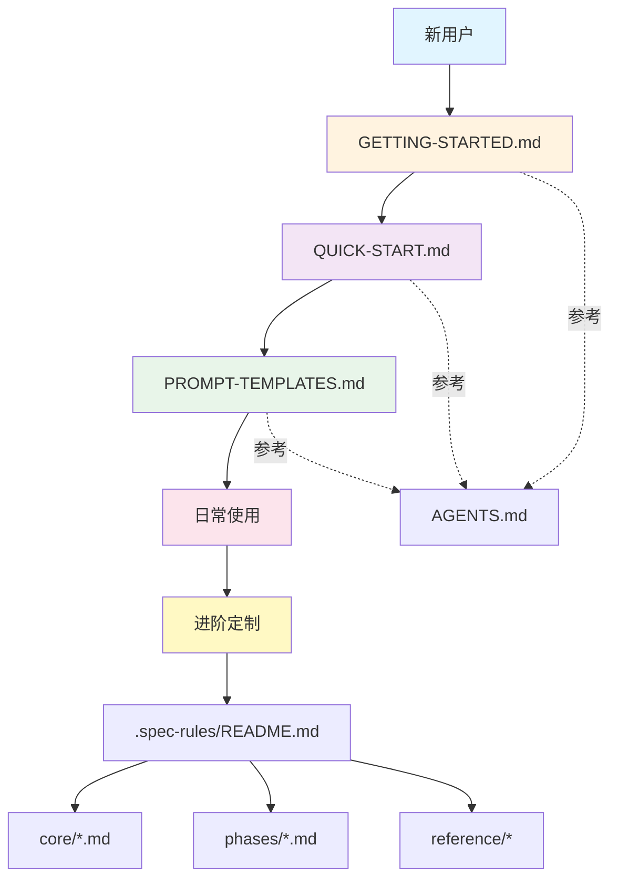

# 📚 SDD 系统文档索引

本文档提供 SDD (Spec-Driven Development) 系统的完整文档导航。

---

## 🎯 根据角色选择文档

### 👤 新用户（第一次使用）

**推荐阅读顺序**：

1. **[GETTING-STARTED.md](GETTING-STARTED.md)** ⭐ 必读
   - 时长：5 分钟
   - 内容：3 步快速开始 + 常见问题
   - 适合：第一次使用 SDD 系统

2. **[QUICK-START.md](QUICK-START.md)**
   - 时长：15 分钟
   - 内容：完整工作流程、阶段详解、常见场景
   - 适合：了解完整流程

3. **[PROMPT-TEMPLATES.md](PROMPT-TEMPLATES.md)**
   - 时长：按需查阅
   - 内容：各阶段提示词模板和最佳实践
   - 适合：日常参考

---

### 👨‍💻 开发者（日常使用）

**常用文档**：

| 场景 | 文档 | 快速跳转 |
|------|------|---------|
| 忘记提示词怎么说 | [PROMPT-TEMPLATES.md](PROMPT-TEMPLATES.md) | 提示词速查表 |
| 工作流程出问题 | [QUICK-START.md](QUICK-START.md) | 故障排查章节 |
| 查看当前阶段规则 | `.spec-rules/phases/[PHASE].md` | - |
| 理解核心协议 | [AGENTS.md](AGENTS.md) | - |

---

### 🏗️ 系统管理员（自定义配置）

**进阶文档**：

1. **[.spec-rules/README.md](.spec-rules/README.md)**
   - 规则系统架构和设计理念
   - 如何自定义规则

2. **各阶段规则文件**：
   - `.spec-rules/phases/PREWORK.md`
   - `.spec-rules/phases/REQUIREMENTS.md`
   - `.spec-rules/phases/DESIGN.md`
   - `.spec-rules/phases/PLAN.md`
   - `.spec-rules/phases/IMPLEMENTATION.md`

3. **模板和示例**：
   - `.spec-rules/reference/templates/` - 文档模板
   - `.spec-rules/reference/templates/examples/` - 完整示例

---

## 📖 文档分类索引

### 📘 入门类（Getting Started）

| 文档 | 描述 | 时长 | 优先级 |
|------|------|------|-------|
| [README.md](README.md) | 项目介绍和概述 | 3 分钟 | ⭐⭐⭐ |
| [GETTING-STARTED.md](GETTING-STARTED.md) | 5 分钟极速入门 | 5 分钟 | ⭐⭐⭐⭐⭐ |
| [QUICK-START.md](QUICK-START.md) | 完整操作手册 | 15 分钟 | ⭐⭐⭐⭐ |

---

### 📗 参考类（Reference）

| 文档 | 描述 | 使用场景 |
|------|------|---------|
| [PROMPT-TEMPLATES.md](PROMPT-TEMPLATES.md) | 提示词模板库 | 忘记怎么向 AI 提问时 |
| [AGENTS.md](AGENTS.md) | AI 核心配置 | 理解 AI 行为规则 |
| [.spec-rules/reference/glossary.md](.spec-rules/reference/glossary.md) | 术语表 | 查找专业术语定义 |

---

### 📙 规则类（Rules）

| 文档 | 描述 | 适合 |
|------|------|------|
| [.spec-rules/README.md](.spec-rules/README.md) | 规则系统总览 | 系统管理员 |
| `.spec-rules/core/protocol.md` | 核心协议 | 深入理解 SDD |
| `.spec-rules/core/phase-router.md` | 阶段路由逻辑 | 理解 AI 决策 |
| `.spec-rules/core/anti-patterns.md` | 反模式清单 | 避免常见错误 |
| `.spec-rules/phases/[PHASE].md` | 各阶段详细规则 | 当前阶段参考 |

---

### 📕 模板类（Templates）

| 文档 | 描述 | 使用场景 |
|------|------|---------|
| `.spec-rules/reference/templates/STATUS.template.json` | 状态跟踪模板 | 手动创建模块 |
| `.spec-rules/reference/templates/CHANGE-REQUEST.template.md` | 变更请求模板 | 需求变更 |
| `.spec-rules/reference/templates/DEVIATION-REPORT.template.md` | 偏差报告模板 | 计划偏差 |
| `.spec-rules/reference/templates/examples/` | 完整示例项目 | 学习参考 |

---

## 🗺️ 学习路径

### 路径 1：快速上手（1 小时）

```
1. 阅读 GETTING-STARTED.md (5 min)
2. 完成第一个简单功能 (30 min)
3. 阅读 PROMPT-TEMPLATES.md 速查表部分 (5 min)
4. 完成第二个功能，尝试不同提示词 (20 min)
```

---

### 路径 2：深入理解（1 天）

```
1. 阅读 QUICK-START.md (15 min)
2. 完成中等复杂功能 (1 hour)
3. 阅读 .spec-rules/README.md (20 min)
4. 阅读各阶段规则文件 (30 min)
5. 完成复杂功能，理解各阶段深度 (2 hours)
6. 实验偏差处理和变更管理 (1 hour)
```

---

### 路径 3：系统定制（1 周）

```
1. 完成路径 1 和 2
2. 阅读 .spec-rules/ 下所有规则文件
3. 自定义 QA 检查清单
4. 编写项目特定的模板
5. 集成到 CI/CD 流程
6. 团队培训和推广
```

---

## 📊 文档关系图



---

## 🔍 按问题查找文档

### "我想快速上手"
→ [GETTING-STARTED.md](GETTING-STARTED.md)

### "我忘记怎么说某个提示词了"
→ [PROMPT-TEMPLATES.md](PROMPT-TEMPLATES.md) 速查表

### "我遇到了问题 X"
→ [QUICK-START.md](QUICK-START.md) 故障排查章节

### "我想理解为什么要这样设计"
→ [.spec-rules/README.md](.spec-rules/README.md)

### "我想自定义某个阶段的规则"
→ `.spec-rules/phases/[PHASE].md`

### "我想看完整的示例项目"
→ `.spec-rules/reference/templates/examples/`

### "我想理解 AI 的决策逻辑"
→ [AGENTS.md](AGENTS.md) + `.spec-rules/core/phase-router.md`

### "我想给团队写培训材料"
→ [GETTING-STARTED.md](GETTING-STARTED.md) + [QUICK-START.md](QUICK-START.md)

---

## 📐 文档层次结构

```
层级 1: 项目入口
├── README.md                    # 项目介绍
└── DOCUMENTATION-INDEX.md       # 本文档

层级 2: 用户指南
├── GETTING-STARTED.md          # 极速入门
├── QUICK-START.md              # 完整操作手册
└── PROMPT-TEMPLATES.md         # 提示词参考

层级 3: 系统配置
├── AGENTS.md                   # AI 核心配置（自动加载）
└── .spec-rules/
    ├── README.md               # 规则系统总览
    ├── core/                   # 核心协议
    ├── phases/                 # 各阶段规则
    └── reference/              # 参考资料和模板

层级 4: 项目产出
└── specs/
    └── [module-name]/          # 每个功能的规格文档
        ├── STATUS.json
        ├── prework.md
        ├── requirements.md
        ├── design.md
        └── plan.md
```

---

## 🎯 文档使用建议

### 📱 打印或收藏

**速查表（建议打印）**：
- [PROMPT-TEMPLATES.md](PROMPT-TEMPLATES.md) 的"打印备忘单"部分
- [QUICK-START.md](QUICK-START.md) 的"快速决策树"部分

**收藏链接（建议浏览器书签）**：
- [GETTING-STARTED.md](GETTING-STARTED.md) - 常见问题
- [PROMPT-TEMPLATES.md](PROMPT-TEMPLATES.md) - 各阶段模板

---

### 📝 团队协作

**新人入职清单**：
1. ✅ 阅读 [README.md](README.md)（了解 SDD）
2. ✅ 跟随 [GETTING-STARTED.md](GETTING-STARTED.md) 完成第一个功能
3. ✅ 阅读 [QUICK-START.md](QUICK-START.md)（理解完整流程）
4. ✅ 收藏 [PROMPT-TEMPLATES.md](PROMPT-TEMPLATES.md)（日常参考）
5. ✅ 独立完成一个中等复杂功能
6. ✅ Code Review：由老员工检查 specs/ 文档质量

**团队共享**：
- 在项目 Wiki 或 Confluence 中链接这些文档
- 定期更新 `.spec-rules/reference/templates/examples/` 中的团队最佳实践

---

### 🔄 文档维护

**版本控制**：
所有文档都纳入 Git 版本控制，修改时：
1. 更新文档内容
2. 修改文档底部的"最后更新"日期
3. 如有重大变更，更新版本号

**反馈机制**：
- 遇到文档不清楚的地方 → 提 Issue
- 有更好的表达方式 → 提 PR
- 发现错误 → 立即修复

---

## 📊 文档统计

| 类型 | 数量 | 总字数（约） |
|------|------|------------|
| 入门指南 | 3 | 15,000 |
| 参考手册 | 2 | 25,000 |
| 规则文档 | 8+ | 20,000 |
| 模板示例 | 5+ | 10,000 |
| **总计** | **18+** | **70,000+** |

**上下文优化**：
- 优化前：~43,000 tokens
- 优化后：~11,700 tokens
- 减少：**72.8%**

---

## ✨ 结语

SDD 系统的文档设计遵循"渐进式披露"原则：
- 新手只需看 3 个文档即可开始
- 日常使用有速查表快速查找
- 高级定制有完整的规则文档

**推荐从这里开始**：
👉 [GETTING-STARTED.md](GETTING-STARTED.md)

---

**版本**: 1.0  
**最后更新**: 2025-12-18  
**文档数量**: 18+  
**总字数**: 70,000+

