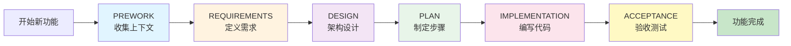

# 🎯 SDD 系统入门指南

欢迎使用 **Spec-Driven Development (SDD)** 系统！本文档将帮助你在 5 分钟内开始使用。

---

## 📚 文档导航

根据你的需求选择合适的文档：

| 文档 | 适用场景 | 阅读时间 |
|------|---------|---------|
| **[GETTING-STARTED.md](GETTING-STARTED.md)** (本文档) | 第一次使用 SDD | 5 分钟 |
| **[QUICK-START.md](QUICK-START.md)** | 了解完整工作流程和常见场景 | 15 分钟 |
| **[PROMPT-TEMPLATES.md](PROMPT-TEMPLATES.md)** | 查找各阶段的提示词模板 | 参考手册 |
| **[.spec-rules/README.md](.spec-rules/README.md)** | 深入了解规则系统架构 | 20 分钟 |
| **[AGENTS.md](AGENTS.md)** | 查看 AI 核心配置 | 参考手册 |

---

## ⚡ 3 步快速开始

### 第 1 步：确认环境 (30秒)

在 Cursor 中打开本项目，发送测试消息：

```
状态
```

**预期响应**：
```
📍 未检测到活动模块
是否要开始新模块？
```

如果看到这个响应，说明 `AGENTS.md` 已被自动加载，系统就绪！✅

---

### 第 2 步：启动你的第一个功能 (2分钟)

发送消息：

```
我要添加用户登录功能
```

**AI 会自动**：
1. 创建 `specs/user-login/STATUS.json`
2. 进入 **PREWORK** 阶段
3. 扫描项目结构，收集上下文
4. 完成后询问："✅ PREWORK 完成。是否进入 REQUIREMENTS 阶段？"

回复：
```
是
```

---

### 第 3 步：让 AI 引导你完成剩余阶段 (15-30分钟)

AI 会依次引导你完成：
- ✅ **REQUIREMENTS** - 定义"做什么"
- ✅ **DESIGN** - 定义"怎么做"
- ✅ **PLAN** - 分解为步骤
- ✅ **IMPLEMENTATION** - 执行步骤
- ✅ **ACCEPTANCE** - 验收测试

每个阶段结束时，AI 会询问是否进入下一阶段，你只需回复"是"或"继续"。

---

## 🎓 理解 SDD 的核心理念

### 为什么需要 SDD？

传统 AI 编程的问题：
- ❌ 直接让 AI "写代码"，容易产生不符合需求的代码
- ❌ 缺乏结构化过程，难以维护和追溯
- ❌ 没有质量门控，容易积累技术债务

SDD 的解决方案：
- ✅ 先想清楚"为什么"和"是什么"，再考虑"怎么做"
- ✅ 每个阶段有明确的产物和验证标准
- ✅ 内置 QA 门控，确保质量

---

### SDD 的工作流程



**关键特点**：
- 🚫 **不能跳过阶段** - 每个阶段都是后续阶段的基础
- ✅ **内置 QA 门控** - 每个阶段结束时自动运行质量检查
- 📝 **文档即代码** - 所有决策都记录在 `specs/` 目录下

---

## 💡 提示词速查表

| 场景 | 推荐提示词 |
|------|-----------|
| 查看状态 | `状态` |
| 启动新功能 | `我要添加 [功能名称]` |
| 继续当前工作 | `继续` |
| 进入下一阶段 | `是` |
| 报告问题 | `步骤 X.X 失败了，错误：[粘贴错误信息]` |
| 暂停工作 | `暂停` |
| 需求变更 | `创建 Change Request：[描述变更]` |

更多提示词模板，参见 **[PROMPT-TEMPLATES.md](PROMPT-TEMPLATES.md)**

---

## 🔧 常见问题

### Q1: AI 没有遵循 SDD 流程怎么办？

**A**: 确认 `AGENTS.md` 被正确加载：
1. 重启 Cursor
2. 发送 `状态` 测试
3. 如果还是不行，查看 Cursor 状态栏是否显示规则加载

---

### Q2: 我可以跳过某些阶段吗？

**A**: 不推荐，但如果是特殊情况（如修小 bug）：
```
强制进入 [阶段名称]（我知道这违反规则）
```
AI 会警告风险，你需要输入 `FORCE OVERRIDE` 确认。

---

### Q3: 中途中断了，如何恢复？

**A**: 发送 `状态`，AI 会读取 `STATUS.json` 并告诉你当前进度：
```
📍 模块：user-login
🔄 当前阶段：DESIGN
➡️ 下一步：定义 API 契约
```
然后发送 `继续` 即可从断点恢复。

---

### Q4: 可以同时开发多个功能吗？

**A**: 可以！每个功能在 `specs/` 下有独立的目录：
```
specs/
├── feature-a/  (STATUS.json: IMPLEMENTATION)
├── feature-b/  (STATUS.json: DESIGN)
└── feature-c/  (STATUS.json: REQUIREMENTS)
```
使用 `切换到 [模块名称]` 在功能之间切换。

---

### Q5: AI 生成的代码质量如何保证？

**A**: SDD 有三层质量保障：
1. **阶段 QA 门控** - 每个阶段结束自动检查
2. **原子步骤验证** - IMPLEMENTATION 阶段每步都有验证命令
3. **验收测试** - ACCEPTANCE 阶段验证所有需求场景

---

## 📈 进阶使用

当你熟悉基础流程后，可以探索：

### 1. 自定义 QA 标准
编辑 `.spec-rules/phases/[PHASE].md` 中的 QA 检查清单。

### 2. 并行开发
同时启动多个模块，互不干扰。

### 3. 集成 CI/CD
在 CI 流程中验证 `STATUS.json` 和 spec 文件。

详见 **[QUICK-START.md](QUICK-START.md)** 的"进阶技巧"章节。

---

## 🎯 学习路径建议

```
第 1 天：完成一个简单功能（如"添加页脚"）
        ↓ 熟悉完整流程
        
第 2-3 天：尝试中等复杂度功能（如"用户登录"）
        ↓ 理解各阶段的深度
        
第 1 周：独立完成复杂功能（如"支付集成"）
        ↓ 掌握偏差处理和变更管理
        
持续：阅读 .spec-rules/ 规则，深入理解设计理念
```

---

## 📞 获取帮助

1. **查阅文档**：
   - 工作流程 → [QUICK-START.md](QUICK-START.md)
   - 提示词 → [PROMPT-TEMPLATES.md](PROMPT-TEMPLATES.md)
   - 规则详解 → [.spec-rules/README.md](.spec-rules/README.md)

2. **查看示例**：
   - `.spec-rules/reference/templates/examples/` 包含完整示例项目

3. **调试模式**：
   ```
   详细解释当前步骤
   显示加载的规则文件
   ```

---

## 🎁 快速决策树

```
我想做什么？
    │
    ├─ 了解系统 → 你已经在正确的文档！继续往下读
    │
    ├─ 开始第一个功能 → 跳到上面"3步快速开始"
    │
    ├─ 查找提示词 → 打开 PROMPT-TEMPLATES.md
    │
    ├─ 理解工作流程 → 打开 QUICK-START.md
    │
    ├─ 深入学习规则 → 打开 .spec-rules/README.md
    │
    └─ 遇到问题 → 查看本文档"常见问题"章节
```

---

## ✨ 成功的关键

1. **信任流程** - SDD 看起来慢，但能避免大量返工
2. **完整走完每个阶段** - 不要跳过 QA 检查
3. **清晰沟通** - 提供明确的上下文和意图
4. **记录决策** - 让 AI 把重要决策写入 spec 文件

---

## 🚀 准备好了吗？

现在，打开 Cursor，发送你的第一条消息：

```
我要添加 [你的功能名称]
```

让 SDD AI Agent 引导你完成第一个功能！

---

**提示**：建议先用一个简单的功能（如"添加关于页面"）来熟悉流程，再尝试复杂功能。

---

**版本**: 1.0  
**最后更新**: 2025-12-18  
**下一步**: 阅读 [QUICK-START.md](QUICK-START.md) 了解完整工作流程

