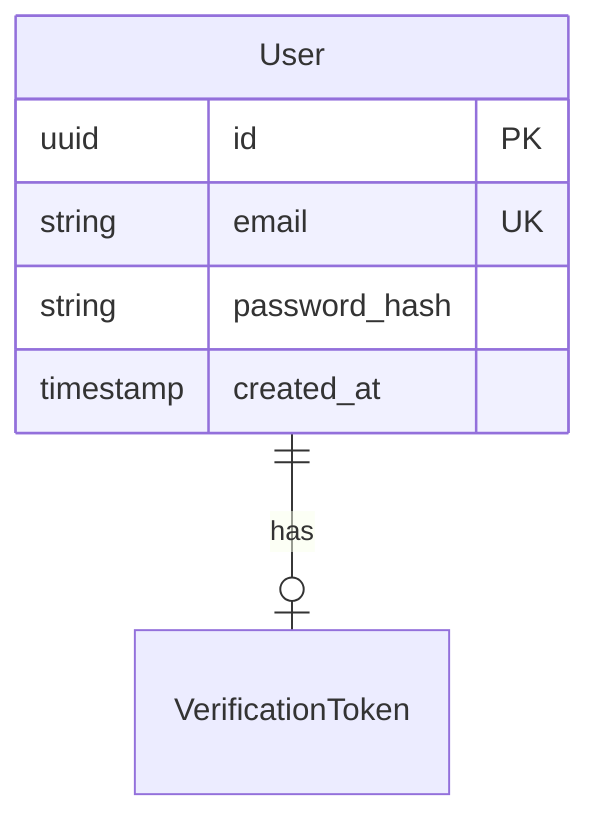

# 🚀 SDD 系统快速上手指南

## 📋 目录

- [系统概述](#系统概述)
- [环境准备](#环境准备)
- [工作流程](#工作流程)
- [阶段提示词模板](#阶段提示词模板)
- [常见场景](#常见场景)
- [故障排查](#故障排查)

---

## 系统概述

**Spec-Driven Development (SDD)** 是一套严格的 AI 辅助开发流程，强制执行：

```
PREWORK → REQUIREMENTS → DESIGN → PLAN → IMPLEMENTATION → ACCEPTANCE
```

**核心特点**：
- 🤖 AI 自动识别当前阶段
- 📝 每个阶段有明确的角色和产物
- ✅ 内置 QA 门控，防止质量滑坡
- 🔄 状态驱动，可随时恢复

---

## 环境准备

### 1. 确认文件结构

```bash
your-project/
├── AGENTS.md                    # AI 核心配置（自动加载）
├── specs/                       # 功能规格目录
│   └── [module-name]/          # 每个功能一个文件夹
│       ├── STATUS.json         # 状态跟踪
│       ├── prework.md          # 上下文收集
│       ├── requirements.md     # 需求文档
│       ├── design.md           # 设计文档
│       └── plan.md             # 实施计划
└── .spec-rules/                # 规则库（按需加载）
    ├── core/                   # 核心协议
    ├── phases/                 # 各阶段规则
    └── reference/              # 参考资料
```

### 2. 验证 AI 配置

在 Cursor 中打开项目，确认：
- ✅ `AGENTS.md` 被自动加载（查看状态栏）
- ✅ AI 能识别 SDD 规则（发送测试消息："状态"）

---

## 工作流程

### 🎯 标准流程（5 分钟快速启动）

```bash
# 步骤 1: 启动新功能
你: "我要添加用户登录功能"

# AI 自动响应：
# 1. 创建 specs/user-login/STATUS.json
# 2. 进入 PREWORK 阶段
# 3. 开始收集项目上下文
```

```bash
# 步骤 2: 完成 PREWORK 后
AI: "✅ PREWORK 已完成。是否进入 REQUIREMENTS 阶段？"
你: "是"

# AI 自动：
# 1. 运行 PREWORK QA 检查
# 2. 更新 STATUS.json
# 3. 切换角色为 Technical Product Manager
```

```bash
# 步骤 3-6: 依次完成各阶段
# 每个阶段结束时，AI 会自动询问是否进入下一阶段
# 你只需回答 "是" 或 "继续"
```

### 🔄 恢复中断的会话

```bash
# 场景：昨天做到一半，今天继续
你: "状态"

# AI 自动：
# 1. 读取 STATUS.json
# 2. 加载当前阶段规则
# 3. 报告："📍 模块：user-login
#           🔄 当前阶段：DESIGN
#           ➡️ 下一步：定义 API 契约"
```

---

## 阶段提示词模板

### 🔍 Phase 0: PREWORK（上下文侦探）

**场景**：开始新功能，AI 需要了解项目

**推荐提示词**：
```
✅ 简洁版（推荐）：
"我要添加 [功能名称]"

✅ 详细版（需要指导时）：
"我要添加 [功能名称]。
目标：[简单描述]
类似功能：[如果有的话]"

❌ 避免：
"直接帮我实现登录" (会触发阶段检查)
```

**AI 预期行为**：
- 扫描项目结构
- 识别框架和依赖
- 查找类似功能
- 列出约束和集成点

**交互示例**：
```
你: "我要添加用户注册功能"

AI: 
📍 模块：user-registration
🔄 当前阶段：PREWORK
➡️ 下一步：收集项目上下文

[AI 开始扫描文件...]
已识别：
- 框架: React + Node.js
- 数据库: PostgreSQL
- 现有认证: JWT in src/auth/
- 类似功能: user-login (已实现)

✅ PREWORK 完成。是否进入 REQUIREMENTS 阶段？
```

---

### 📝 Phase 1: REQUIREMENTS（产品经理）

**场景**：定义"做什么"，不涉及"怎么做"

**推荐提示词**：
```
✅ 让 AI 主导（推荐）：
"继续 REQUIREMENTS"
"开始写需求"

✅ 提供输入（有具体想法时）：
"需求重点：
1. 支持邮箱注册
2. 需要邮件验证
3. 密码强度检查"

✅ 澄清边界：
"这个功能不需要社交登录"
"只做核心流程，高级功能后续迭代"

❌ 避免：
"用 bcrypt 加密密码" (这是设计阶段的事)
"创建 User 表" (这是实现阶段的事)
```

**AI 预期行为**：
- 用 Gherkin 格式编写场景
- 定义验收标准
- 明确用户价值

**交互示例**：
```
你: "继续 REQUIREMENTS"

AI:
已创建 specs/user-registration/requirements.md

## 核心场景

### Scenario 1: 成功注册
**Given** 用户访问注册页面
**When** 填写有效的邮箱和密码
**And** 点击"注册"按钮
**Then** 系统发送验证邮件
**And** 显示"请查收邮件"提示

[...更多场景...]

✅ REQUIREMENTS 通过 QA 检查。是否进入 DESIGN 阶段？
```

---

### 🏗️ Phase 2: DESIGN（系统架构师）

**场景**：定义技术方案和架构

**推荐提示词**：
```
✅ 标准流程：
"继续 DESIGN"

✅ 有技术偏好：
"DESIGN 阶段，我希望：
- 使用 Redis 缓存验证码
- 密码用 argon2 而非 bcrypt"

✅ 需要讨论：
"在设计数据库 schema 前，我想讨论用户表结构"

❌ 避免：
"直接写代码" (还没到实现阶段)
```

**AI 预期行为**：
- 绘制架构图（Mermaid）
- 定义数据模型和 API 契约
- 评估复杂度和风险

**交互示例**：
```
你: "继续 DESIGN"

AI:
已创建 specs/user-registration/design.md

## 数据模型



## API 契约

POST /api/auth/register
Request:
{
  "email": "user@example.com",
  "password": "SecurePass123!"
}

[...更多设计...]

✅ DESIGN 通过 QA 检查。是否进入 PLAN 阶段？
```

---

### 📋 Phase 3: PLAN（工程经理）

**场景**：分解为可执行步骤

**推荐提示词**：
```
✅ 标准流程：
"继续 PLAN"
"制定实施计划"

✅ 有约束：
"PLAN 阶段，注意：
- 我们没有测试环境，需要用 feature flag
- 数据库迁移需要可回滚"

❌ 避免：
"开始实现" (还在计划阶段)
```

**AI 预期行为**：
- 分解为原子步骤（每步 ≤30 分钟）
- 为每步定义验证命令
- 设置里程碑检查点

**交互示例**：
```
你: "继续 PLAN"

AI:
已创建 specs/user-registration/plan.md

## 实施步骤

### Milestone 1: 数据层
- [ ] 步骤 1.1: 创建数据库迁移文件
  验证: `npm run migrate:dry`
  
- [ ] 步骤 1.2: 定义 User model
  验证: `npm run test:unit -- user.model.test.ts`

[...更多步骤...]

✅ PLAN 通过 QA 检查。是否进入 IMPLEMENTATION 阶段？
```

---

### ⚙️ Phase 4: IMPLEMENTATION（初级开发）

**场景**：严格执行计划

**推荐提示词**：
```
✅ 标准流程：
"开始实现"
"执行步骤 1.1"

✅ 跳过已完成：
"步骤 1.1 到 1.3 我已经做了，从 1.4 开始"

✅ 遇到问题：
"步骤 2.3 的测试失败了，帮我看看"

❌ 避免：
"顺便也把社交登录做了" (范围蔓延)
"跳过测试，直接下一步" (违反规则)
```

**AI 预期行为**：
- 逐步执行 plan.md
- 运行验证命令
- 遇错则停止（Stop-and-Fix）

**交互示例**：
```
你: "开始实现"

AI:
执行步骤 1.1: 创建数据库迁移文件

[AI 创建文件...]

验证: npm run migrate:dry
✅ 迁移文件语法正确

更新 plan.md: [x] 步骤 1.1

---

执行步骤 1.2: 定义 User model

[AI 创建文件...]

验证: npm run test:unit -- user.model.test.ts
❌ 测试失败: email validation 不正确

[AI 修复代码...]

验证: npm run test:unit -- user.model.test.ts
✅ 测试通过

更新 plan.md: [x] 步骤 1.2

[继续下一步...]
```

---

### ✅ Phase 5: ACCEPTANCE（QA 工程师）

**场景**：验证功能满足需求

**推荐提示词**：
```
✅ 开始验收：
"进行验收测试"
"demo 功能"

✅ 手动测试配合：
"我已经手动测试了场景 1 和 2，帮我验证场景 3"

❌ 避免：
"直接通过吧" (AI 会拒绝)
```

**AI 预期行为**：
- 逐一验证 requirements.md 中的 Gherkin 场景
- 尝试找出问题（不是橡皮图章）
- 生成验收报告

---

## 常见场景

### 🆕 场景 1: 全新功能（零到一）

```bash
你: "我要添加文件上传功能"

# AI 自动完成：
# ✅ 创建 specs/file-upload/STATUS.json
# ✅ 进入 PREWORK，收集上下文
# ✅ 询问是否进入 REQUIREMENTS

你: "是" （依次确认每个阶段）

# 30-60 分钟后，功能开发完成
```

---

### 🔄 场景 2: 中断后恢复

```bash
# 昨天做到一半
你: "状态"

AI: 
📍 模块：file-upload
🔄 当前阶段：IMPLEMENTATION
➡️ 下一步：执行步骤 3.2 - 实现文件校验

你: "继续"

# AI 从断点继续执行
```

---

### 🐛 场景 3: 实施阶段遇到问题

```bash
# 步骤执行失败
AI: 
❌ 步骤 2.3 验证失败
错误: TypeError: Cannot read property 'size' of undefined

🚨 已尝试修复 3 次，仍然失败
建议：
1. 检查 plan.md 步骤 2.2 是否正确完成
2. 可能需要修改 design.md 中的文件处理逻辑

是否需要创建 Deviation Report？

你: "创建 Deviation Report"

# AI 创建偏差报告，提议修改 design 或 plan
```

---

### 🔀 场景 4: 需求变更

```bash
# IMPLEMENTATION 阶段突然想改需求
你: "我想把单文件上传改成多文件"

AI:
⚠️ 检测到需求变更。当前阶段：IMPLEMENTATION
不能在实施阶段修改需求。

建议：
1. 创建 Change Request
2. 完成当前功能
3. 创建新模块 "file-upload-v2" 或修改现有规格

是否创建 Change Request？

你: "是"

# AI 创建 specs/file-upload/CHANGE-REQUEST-001.md
```

---

### 🔍 场景 5: 查看任意模块状态

```bash
你: "查看所有模块状态"

AI:
📊 项目状态总览

1. file-upload
   状态: IMPLEMENTATION (步骤 3/12)
   最后更新: 2025-12-18

2. user-login
   状态: COMPLETE
   完成时间: 2025-12-15

3. payment-integration
   状态: DESIGN
   下一步: 定义支付网关接口
```

---

## 故障排查

### ❓ AI 没有遵循 SDD 规则

**原因**：`AGENTS.md` 可能未被加载

**解决**：
```bash
# 1. 确认文件存在
ls -la AGENTS.md

# 2. 重启 Cursor

# 3. 测试提示
你: "状态"

# 应该看到 AI 读取 STATUS.json
```

---

### ❓ AI 想跳过阶段

**原因**：用户的提示词可能暗示跳过

**解决**：
```bash
❌ 错误示例：
你: "帮我直接实现登录功能"
AI: (可能会尝试跳过 PREWORK/REQUIREMENTS/DESIGN/PLAN)

✅ 正确示例：
你: "我要添加登录功能"
AI: (自动进入 PREWORK，按流程走)
```

---

### ❓ STATUS.json 丢失或损坏

**原因**：手动删除或编辑错误

**解决**：
```bash
你: "STATUS.json 损坏了，怎么办？"

AI: 
检测到 STATUS.json 不可用。

选项：
1. 从最后的 phase 文件重建（推荐）
2. 重新开始模块
3. 手动恢复

你: "选项 1"

# AI 从 requirements.md, design.md 等推断状态并重建
```

---

### ❓ 想要强制进入某个阶段（不推荐）

**场景**：测试或特殊情况

**解决**：
```bash
你: "强制进入 DESIGN 阶段（我知道这违反规则）"

AI:
⚠️ 警告：强制跳过阶段会导致：
- QA 检查失效
- 上下文不完整
- 后续阶段可能失败

确认强制进入？(输入 "FORCE OVERRIDE")

你: "FORCE OVERRIDE"

# AI 更新 STATUS.json，但标记为 "FORCED"
```

---

## 📚 进阶技巧

### 1. 并行开发多个功能

```bash
# 每个功能独立的 specs/ 子目录
specs/
├── feature-a/
│   └── STATUS.json (currentPhase: IMPLEMENTATION)
├── feature-b/
│   └── STATUS.json (currentPhase: DESIGN)
└── feature-c/
    └── STATUS.json (currentPhase: REQUIREMENTS)

# 切换上下文
你: "切换到 feature-b"
AI: 读取 specs/feature-b/STATUS.json...
```

---

### 2. 自定义 QA 标准

编辑 `.spec-rules/phases/[PHASE].md` 的 QA 清单：

```markdown
## QA 检查清单

### 必需检查
- [ ] API 文档已生成
- [ ] 性能测试通过（响应时间 < 200ms）  ← 新增
- [ ] 安全扫描无高危漏洞              ← 新增
```

---

### 3. 集成 CI/CD

```yaml
# .github/workflows/sdd-validate.yml
name: SDD Validation
on: [pull_request]
jobs:
  validate:
    runs-on: ubuntu-latest
    steps:
      - name: Check STATUS.json
        run: |
          if [ ! -f specs/*/STATUS.json ]; then
            echo "❌ 缺少 STATUS.json"
            exit 1
          fi
      
      - name: Verify phase completion
        run: |
          phase=$(jq -r '.currentPhase' specs/*/STATUS.json)
          if [ "$phase" != "COMPLETE" ]; then
            echo "⚠️ 功能未完成: $phase"
            exit 1
          fi
```

---

## 🎓 最佳实践

1. **每天第一条消息发 "状态"**
   - 让 AI 重新加载上下文
   - 确认从正确的位置继续

2. **不要省略 PREWORK**
   - 多花 5 分钟收集上下文
   - 节省后续 1 小时的返工

3. **REQUIREMENTS 阶段多沟通**
   - 在这个阶段改需求成本最低
   - 进入 IMPLEMENTATION 后改动成本 10x

4. **信任 QA 门控**
   - 被拒绝不是坏事
   - 这是系统帮你避坑

5. **保留所有 spec 文件**
   - 这是项目的知识库
   - 未来的 AI 可以从中学习

---

## 📞 获取帮助

- **规则详解**：查看 `.spec-rules/README.md`
- **模板参考**：查看 `.spec-rules/reference/templates/`
- **示例项目**：查看 `.spec-rules/reference/templates/examples/`

---

## 🎯 快速决策树

```
用户输入
    │
    ├─ 包含"状态/进度" → 读取 STATUS.json 并报告
    │
    ├─ 包含"新功能/要添加" → 创建 STATUS.json → PREWORK
    │
    ├─ 包含"继续/下一步" → 读取 currentPhase → 继续执行
    │
    ├─ 包含"实现/写代码" 
    │   └─ currentPhase != IMPLEMENTATION? → 拒绝，提示先完成前置阶段
    │
    └─ 其他 → 询问用户意图
```

---

## ✨ 格言

> **"AI 不会偷懒，但会执行你的每一个字。"**  
> **"规格即合同，QA 即保险。"**  
> **"慢就是快，少就是多。"**

---

**版本**: 1.0  
**最后更新**: 2025-12-18  
**配套系统**: AGENTS.md v1.0

